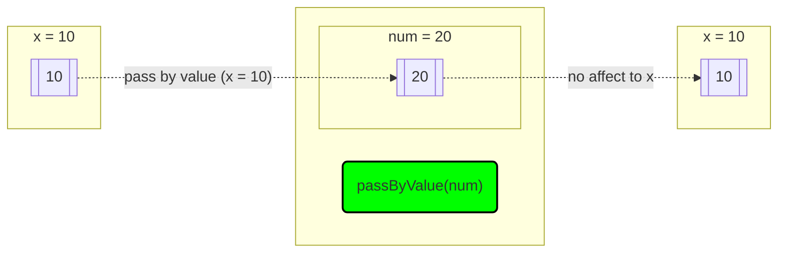
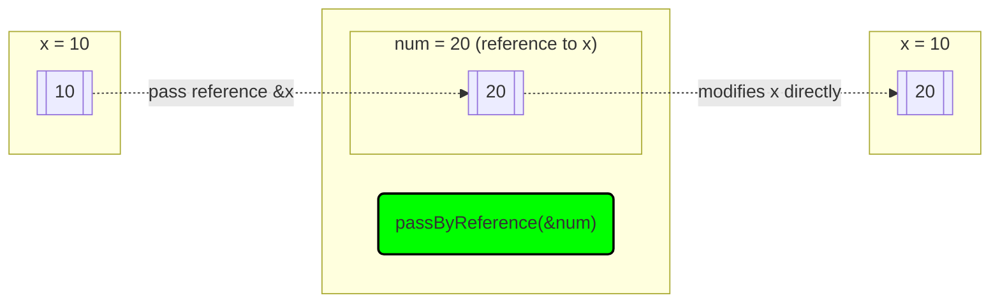
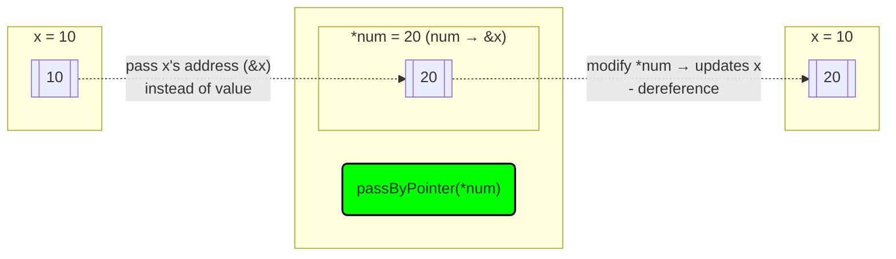

# Pass by Value (Copy)

>**Note**
> - A **copy** of the variable is passed to the function.
> - Changes inside the function **do not** affect the original variable.

```cpp
#include <iostream>
using namespace std;

void passByValue(int num) {
    num = 20;  // Changing the value inside the function
    cout << "Inside function (pass by value): " << num << endl;
}

int main() {
    int x = 10;
    passByValue(x);
    cout << "After function call (main): " << x << endl; // x is still 10
    return 0;
}
```
>**📌Output**
>```js
>	Inside function (pass by value): 20
>	After function call (main): 10
>```

💡 **Explanation:**
- The function `passByValue(int num)` receives a copy of `x`, so modifying `num` does not affect `x` in `main()`.


# Pass by Reference (Use Original Variable)

>**Note**
>- The function gets the **actual variable**, not a copy.
>- Changes inside the function **do affect** the original variable.

```cpp
void passByReference(int &num) {  // Note the '&' (reference)
    num = 20;  // This modifies the original variable
    cout << "Inside function (pass by reference): " << num << endl;
}

int main() {
    int x = 10;
    passByReference(x);
    cout << "After function call (main): " << x << endl; // x is changed to 20
    return 0;
}
```
>**📌Output**
>```js
> 	Inside function (pass by reference): 20
> 	After function call (main): 20
>```


💡 **Explanation:**
- The function `passByReference(int &num)` receives a **reference to `x`**, so modifying `num` **also modifies `x`** in `main()`.




# Pass by Pointer (Use Memory Address)

>**Note:**
> - A **pointer** (memory address) is passed to the function.
> - The function modifies the **actual variable** using the pointer.

```cpp
void passByPointer(int *num) {  // Pointer parameter
    *num = 20;  // Dereferencing (*) modifies the actual variable
    cout << "Inside function (pass by pointer): " << *num << endl;
}

int main() {
    int x = 10;
    passByPointer(&x);  // Passing the address of x
    cout << "After function call (main): " << x << endl; // x is changed to 20
    return 0;
}
```
>**📌Output**
>```javascript
> 	Inside function (pass by pointer): 20
> 	After function call (main): 20
>```

💡 **Explanation:**
- `passByPointer(int *num)` receives a pointer to `x`.
- Using `*num = 20;`, we modify the **actual value of `x`**.
- `num` **stores x’s address** (`&x`) and **modifies `x`** via `*num`"



## Example & Walkthrough

```cpp
#include <iostream>
using namespace std;

void passByValue(int num){
    num = 20;
    cout << "passByValue: " << num << endl;
}
void passByReference(int &num){
    num = 30;
    cout << "\npassByReference: " << num;
    cout << "\t\t&num: " << &num << endl;
    // cout << "\t*num: " << *num;    (ERROR)
}
void passByPointer(int *num){
    *num = 40;
    cout << "\npassByPointer: " << *num;
    cout << "\t\t&num: " << &num;
    cout << "\tnum: " << num << endl;
}

int main() {
    int x = 10;
    cout << "Original x: " << x << endl << endl;  
    passByValue(x);
    cout << "\t&x: " << &x;
    passByReference(x);
    cout << "\t&x: " << &x;
    passByPointer(&x);
    cout << "\t&x: " << &x;
    cout << "\nCurrent x: " << x << endl;
    return 0;
}
```
> **📌Output**
> ```js
> Original x: 10
> 
> passByValue: 20
>    &x: 0x7ffcbc170f04
> passByReference: 30     &num: 0x7ffcbc170f04
>    &x: 0x7ffcbc170f04
> passByPointer: 40       &num: 0x7ffcbc170ed8    num: 0x7ffcbc170f04
>    &x: 0x7ffcbc170f04
>Current x: 40 
> ```

>**📝 Note** 
>These lines print various information about the pointer and the variable it points to:
>- **`*num`**: Prints the *value stored in the variable* pointed to by `num`.
>- **`&num`**: Prints the *memory address of the pointer* `num` ***itself***.
>- **`num`**: Prints the *memory address stored within the pointer* `num`, which is the *address of the variable it points to*.

### Visualization 
```
In memory:
+--------+           +--------+
|   x    | <-------- |  num   |
| value: |           | value: | (contains address of x)
|   40   |           | 0x1234 |
| addr:  |           | addr:  |
| 0x1234 |           | 0x5678 |
+--------+           +--------+
                        ^
                        |
                      &num = 0x5678 (address of the pointer variable)
```
